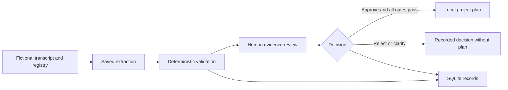

# FDE Meeting Review

**A working personal portfolio project by Felipe Marques Luz: turning meeting commitments into controlled, traceable project plans.**

Built with AI coding assistance. This repository is a curated, offline demonstration of my broader FDE workflow project. It is not a paid client deployment or a production-certified system.

## Why I built it

Meeting notes mix commitments, suggestions, uncertain deadlines, and conflicting project information. Sending all of them directly into a task system creates unreliable records. I designed a workflow that separates extraction from validation and requires an explicit human decision before producing a plan.

## Try it in five minutes

Use **Windows and Node.js 24 or later**. No package installation, API account, Docker, or paid model call is needed.

```sh
npm test
npm start
```

Open http://127.0.0.1:3210 and select **Start a review**.

1. **PT05**: inspect a supported commitment, confirm its evidence, and approve it. Download the approved plan.
2. **PT04**: inspect conflicting project identities. Approval must remain blocked.
3. **Full regression**: inspect confirmed tasks, a dependency, exclusions, and a suggestion. Notice what does not become a commitment.

The examples use fictional people and projects. Extraction results are prerecorded fixtures: the demo executes the validation, review, persistence, and export stages, not a live AI call. Use fictional data only. Local runs are stored under `data/` and excluded from Git.

## What the system demonstrates

| Capability | Implementation |
|---|---|
| Structured records | Approved project and owner registries; strict extraction schema |
| Traceability | Transcript line references and literal evidence checks |
| Data quality | Missing owners, unconfirmed dates, conflicts, and dependency checks |
| Approval controls | Evidence confirmation, immutable review digest, one final decision |
| Auditability | SQLite run records and audit events |
| Usable output | Local JSON and Markdown exports |
| Verification | Automated core, consent, model-adapter, and HTTP tests |



## My contribution and use of AI

I defined the workflow requirements, approved-record model, evidence rules, exception paths, and human approval experience. I directed AI-assisted implementation and iterative troubleshooting, including the transition from an earlier n8n prototype to a standalone local application. AI coding tools assisted with code, tests, and documentation; I do not present this as unaided software engineering.

## Relevance to finance and business systems

The project demonstrates practices transferable to finance operations: reliable master records, evidence attached to decisions, explicit approval, exception handling, and repeatable reporting. These complement my Airbus FP&A experience in annual planning, forecasting, KPI dashboards, and reporting automation. The demo does not implement accounting reconciliation, funded-project claims, or Airtable/ERP integration.

## Architecture and scope

Node.js serves a browser interface; SQLite stores local records. No third-party npm runtime packages are required. `src/core.js` owns validation; `src/workflow.js` owns decisions and exports; `src/db.js` owns persistence; `src/server.js` exposes the local HTTP interface.

The original model adapter is retained in `src/model.js` for technical inspection and mocked tests. **The portfolio server does not call it.** Personal model configuration, credentials, conversation history, runtime databases, and client files are excluded. Re-enabling a model route is outside this demo's scope.

This is a single-user local demonstration, not an internet-facing service. There is no Notion writer or other external destination. Passing tests is not a security certification or proof of AI extraction accuracy. No quantified time savings or customer outcomes are claimed.

See [verification](docs/VERIFICATION.md) and [Astra supporting case study](docs/ASTRA.md).

## Author

Felipe Marques Luz | [LinkedIn](https://www.linkedin.com/in/felipe-luz-b9656b195/)
