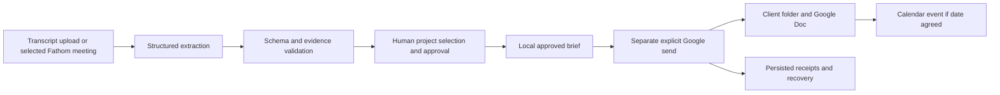

# Felipe Marques Luz — AI workflow portfolio

I design AI-assisted business workflows in which a person stays in control: requirements defined first, evidence attached to every proposal, explicit human approval, and honest limits on what is claimed. My background is mechanical engineering, financial business analysis at Airbus, strategy consulting and technical customer support.

This repository holds one runnable project, **FDE Meeting Review**, and an overview of my other recent work. Portfolio last updated **7 October 2026**.

| Project | What it is | Status |
|---|---|---|
| [FDE Meeting Review](#fde-meeting-review) | Turns client meeting transcripts into project briefs with source quotations and human approval | Public, runnable in this repository |
| [Small-business operations dashboard](#small-business-operations-dashboard) | Local dashboard joining online-shop orders, invoicing and payment review, with an owner handover package | Private; described below |
| [Dog Content Studio](#dog-content-studio) | Content assistant for creators: upload, AI recommendations, human approval, publish | Private prototype; described below |
| [Personal AI operating system](#personal-ai-operating-system) | Structured context, connections and reusable skills for AI assistants | Private; described below |
| [FDE landing page](#fde-landing-page) | Bilingual service landing-page mockup | Private mockup; described below |
| [Astra](docs/ASTRA.md) | Personal AI assistant and working environment | Private; case study in this repository |

Only FDE Meeting Review publishes source code here. The other repositories stay private because they contain business records, personal context or unfinished work; their descriptions state what exists and what does not.

---

## FDE Meeting Review

**Turn a client meeting into project briefs a person can inspect, approve and trace back to the source.**

A working personal portfolio project, built with AI coding assistance. The application combines structured extraction, deterministic validation, human approval and recoverable delivery. This edition reflects the project-brief workflow as of **15 September 2026**.

[Verification](docs/VERIFICATION.md) · [Architecture](docs/ARCHITECTURE.md) · [Connected edition](docs/CONNECTED.md) · [What changed](CHANGELOG.md)

### Try it in five minutes

Use **Windows with Node.js 24 or later**. Download this repository with **Code → Download ZIP** and extract it, or clone it. Open a terminal in the repository folder:

```sh
npm test
npm start
```

No package installation, API key, subscription or Docker is needed for the demo. In PowerShell, if execution policy blocks `npm.ps1`, use `npm.cmd test` and `npm.cmd start` instead. No policy change is needed.

Open **http://127.0.0.1:3211** and select **Start a review**.

1. Choose **Website + an undecided catalogue**, enter your reviewer name and build the review.
2. Open **View source** to inspect the exact quotations. Select the website; leave the unagreed catalogue unselected.
3. Confirm your evidence review and click **Approve selected**.
4. Open **Downloads & history**. Download the Markdown brief or structured JSON. Only the website is approved.
5. Try **Portuguese brief without a deadline**: the missing date stays unspecified. Try **Invalid evidence**: validation rejects the extraction before saving a review.

The transcripts and extraction results are authored fictional examples. Extraction is prerecorded; validation, approval, SQLite persistence and export execute for real. The demo ignores configured external connections and rejects live extraction and delivery requests. Stop the server with **Ctrl+C**. To use a different port, set `FDE_WORKFLOW_PORT` before starting.

### The problem and the design

Meeting transcripts mix agreed scope, possible projects, requirements and incomplete dates. Turning all of that directly into work records can create commitments nobody actually made.

This workflow keeps the source attached to the proposed work. A reviewer chooses which projects to approve, checks quotations and records a final decision. A label such as **Confirmed proposals** describes the extraction's assessment; it is never human approval.

| Capability | What to inspect |
|---|---|
| Project briefs | Deliverables, requirements and agreed project delivery dates; missing dates remain empty |
| Evidence checks | Literal quotations, numbered source lines, strict extraction schema and date support |
| Human control | Explicit project selection, evidence confirmation, named reviewer and one final decision |
| Record integrity | Source/review hashes, approval expiry and local audit events |
| Useful output | Markdown briefs and JSON retaining structured evidence and approval |
| Google delivery | In connected mode: client folders, native Docs and all-day deadline events |
| Recovery | Persisted receipts, identity checks and reconciliation of uncertain cloud writes |
| Transcript intake | Local text/JSON upload; optional selected Fathom meeting import |

### From demonstration to connected workflow

The repository includes the current Google and Fathom adapters and their mocked tests. **`npm start` runs the offline portfolio.** The explicitly selected connected edition uses the same review logic and adds transcript extraction and external delivery:



Google delivery does not share files, invite attendees or send notification emails. Fathom import does not start extraction automatically. Connected mode needs your own separately configured services; see [setup and limitations](docs/CONNECTED.md). The default demo requires none of them.

### My contribution

I defined the workflow requirements, evidence rules, approval boundaries, exception handling and reviewer experience. I directed the transition from an earlier n8n prototype to a standalone local application, then from task lists to client project briefs and Google delivery.

AI coding tools assisted with implementation, tests, documentation and independent code review. I do not present this as unaided engineering. The project demonstrates business-process design, requirements translation, API integration and evidence-based verification, complementing my Airbus FP&A experience in planning, forecasting and reporting automation.

### Verification and scope

**95 automated tests passed; one optional Windows credential-encryption test was skipped** in the 15 September local check. Tests exercise both offline behavior and connected components with mocked external responses. See [the verification record](docs/VERIFICATION.md) for exact limits.

This is a single-user local application and personal portfolio, not a paid client deployment or a production-certified service. No customer adoption, quantified time savings or production extraction accuracy is claimed. Browser visual testing for this update remains pending. Credentials, client files, assistant configuration, conversations and runtime databases are excluded from the repository.

---

## Other recent work

These projects were built or extended after the 15 September edition above. As with FDE Meeting Review, AI coding tools assisted with implementation; my part is the requirements, process design, control points and review.

### Small-business operations dashboard

*October 2026 · private repository*

A local dashboard for a small producer that sells online. It brings together online-shop orders, invoicing and payment review so the owner can see what was ordered, invoiced and paid in one place.

- Connects to the shop and invoicing systems through their official integrations; credentials are excluded from the repository and authorised by the owner on their own computer.
- Keeps a record of invoicing actions so a repeated run does not issue a duplicate receipt.
- Delivered with an owner handover package: written instructions and a file manifest with a SHA-256 hash for every included file, plus a list of what was deliberately left out.

The repository is private because it contains the business's own records. No revenue or time-saving figures are claimed.

### Dog Content Studio

*Private prototype*

An application intended to help dog content creators prepare Instagram posts: upload media, receive AI-assisted caption, hashtag and timing recommendations, approve a final version, then publish through the platform's official API.

- What exists today: a local interface prototype that previews images and videos and saves drafts in the browser, an API contract (OpenAPI) with generated client and validation code, and a milestone plan.
- What does not exist yet: AI analysis, publishing, permanent media storage and the database connection.
- Product rule written into the requirements: recommendations may improve a post, but the product never promises that a post will go viral.

### Personal AI operating system

*October 2026 · private repository*

My personal working environment for AI assistants: written context about my projects, routes to the sources an assistant may read, and reusable skills for recurring work, usable from more than one assistant. It is built on the open-source AIS-OS starter kit by Nate Herk (MIT licence); the structure is his, the content and configuration are mine.

What I take from it for client work: an assistant is only as reliable as the context it can find, so the context is kept in files and checked with evidence-based audits rather than assumed. The repository is private because it holds personal context.

### FDE landing page

*Private mockup*

A responsive landing-page mockup in English and European Portuguese for a workflow-automation service, with a workflow diagram, offer journey and accessible FAQ. The booking button is deliberately disabled, and no customer proof, legal identity or analytics has been invented; search indexing is blocked until a real launch.

---

**Author:** Felipe Marques Luz · [LinkedIn](https://www.linkedin.com/in/felipe-luz-b9656b195/) · [GitHub](https://github.com/FelipeLuz5)
